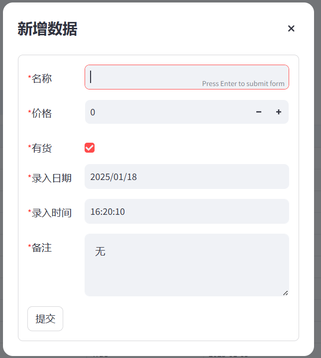
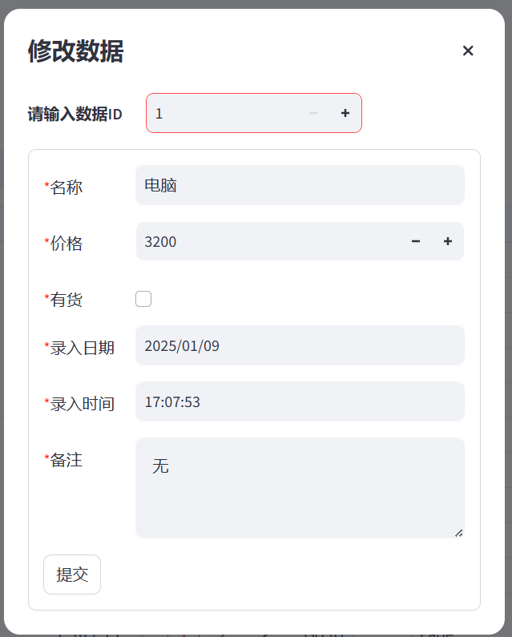

# Streamlit-Crud
**自动生成ui界面，并实现CRUD功能**

\
\

## 目录
* [概述](README-zh.md##一、概述)
* [功能](README-zh.md##二、功能)
* [使用方法](README-zh.md##三、使用方法)
* [版本说明](README-zh.md##四、版本说明)

## 一、概述
本模块是一个类，根据数据库模型，自动生成表单组件，和增删改查按钮。\
表单提交后，实现数据库的增删改查功能。

## 二、功能
- 1、根据数据库模型，动态生成表单组件。\
   表单组件根据模型的字段类型，动态生成对应的输入组件。
- 2、生成有增删改查按钮，提交后实现数据库的增删改查功能。
- 3、数据库以dataframe表格显示，表格配有过滤搜索、分页、下载功能。
- 4、在根目录下新增log文件夹，以当前日期创建日志文件，记录增删改查信息。
- 5、默认加载样式修改：设置header高度为1，减少body外边距
> 备注：新增的表格导出，以本地时间生成文件名。\
> streamlit表格的下载，使用UTC时间。所以增加这个导出功能。

## 三、使用方法
- 1、安装依赖包
```python
pip install streamlit_crud
pip install streamlit sqlmodel streamlit_antd_components pandas
```
ui组件生成，使用streamlit\
数据库模型，使用的sqlmodel\
表格分页功能，使用streamlit_antd_components\
表格过滤，使用pandas
- 2、使用示例

**StreamlitCrud类需要两个参数，第一个参数为数据库模型类，第二个参数为数据库连接地址。**\
**运行StreamlitCrud的main方法，就可以生成UI界面和实现CRUD功能。**
> 备注：\
> 1、数据库模型类中，字段名称为"备注"时，会使用多行文字组件。\
> 2、表单组件的初始值，根据模型字段的default值初始化。\
> 3、新增和修改表单时，表单中每一项都是必须填写项，没有填写会提示错误。\
> 4、streamlit要设置 wide 模式，否则按钮会挤到一起
st.set_page_config ( layout="wide" )

```python
import streamlit as st
from sqlmodel import SQLModel, Field
from streamlit_crud import StreamlitCrud
from datetime import date, datetime

# 定义数据库模型类
class Data(SQLModel, table=True):
    __tablename__ = "data"
    __table_args__ = {'extend_existing': True}
    id: int = Field(default=None, primary_key=True,
                    sa_column_kwargs={"autoincrement": True})
    名称: str = Field(default="")
    名称: str = Field(default="")
    价格: float = Field(default=0.0)
    有货: bool = Field(default=True)
    录入日期: date = Field(default=date.today())
    录入时间: str = Field(default=datetime.now().strftime('%H:%M:%S'))
    备注: str = Field(default="无")  # 备注属性会使用多行文字组件

database_url = "sqlite:///example.db"
# 要选择wide模式，否则按钮会挤到一起
st.set_page_config(page_title="数据管理系统",  layout="wide")
stcrud = StreamlitCrud(Data, database_url)
stcrud.main()
```
## 四、版本说明

v 0.1
提供class模块，实现数据库增删改查功能。
